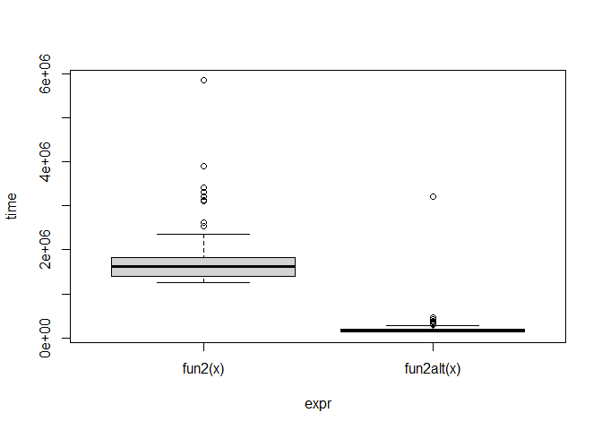

Lab 9 - HPC
================

# Learning goals

In this lab, you are expected to learn/put in practice the following
skills:

  - Evaluate whether a problem can be parallelized or not.
  - Practice with the parallel package.
  - USe Rscript to submit jobs
  - Practice your skills with Git.

<!-- end list -->

``` r
library(microbenchmark)
```

## Problem 1: Think

Give yourself a few minutes to think about what you just learned. List
three examples of problems that you believe may be solved using parallel
computing, and check for packages on the HPC CRAN task view that may be
related to it.

Parallel Computing can be useful in:

\-Stimulating the spread of environmental pollutants (package: maanova)

\-Doing linear and logistic regressions of large quantities of health
data to improve treatment (package: biglm)

\-Cross-validation in machine learning (package: carat)

\-Bootstrapping (package: boot)

## Problem 2: Before you

The following functions can be written to be more efficient without
using parallel:

1.  This function generates a `n x k` dataset with all its entries
    distributed poission with mean `lambda`.

<!-- end list -->

``` r
fun1 <- function(n = 100, k = 4, lambda = 4) {
  x <- NULL
  for (i in 1:n)
    x <- rbind(x, rpois(k, lambda))
  x
}

fun1alt <- function(n = 100, k = 4, lambda = 4) {
   matrix(rpois(n*k,lambda),ncol = k)
}

# Benchmarking
microbenchmark::microbenchmark(
  fun1(),
  fun1alt(),unit = "relative"
)
```

    ## Unit: relative
    ##       expr      min       lq     mean   median       uq      max neval
    ##     fun1() 17.57277 22.98246 14.51517 23.24867 23.42466 7.813917   100
    ##  fun1alt()  1.00000  1.00000  1.00000  1.00000  1.00000 1.000000   100

2.  Find the column max (hint: Checkout the function `max.col()`).

<!-- end list -->

``` r
# Data Generating Process (10 x 10,000 matrix)
set.seed(1234)
x <- matrix(rnorm(1e4), nrow=10)

# Find each column's max value
fun2 <- function(x) {
  apply(x, 2, max)
}

fun2alt <- function(x) {
  x[
    cbind(
      max.col(t(x)),
      1:ncol(x))
    ]
}

# Benchmarking
ans_bench <-microbenchmark::microbenchmark(
  fun2(x),
  fun2alt(x),unit = "relative"
)

plot(ans_bench)
```

<!-- -->

## Problem 3: Parallelize everyhing

We will now turn our attention to non-parametric
[bootstrapping](https://en.wikipedia.org/wiki/Bootstrapping_\(statistics\)).
Among its many uses, non-parametric bootstrapping allow us to obtain
confidence intervals for parameter estimates without relying on
parametric assumptions.

The main assumption is that we can approximate many experiments by
resampling observations from our original dataset, which reflects the
population.

This function implements the non-parametric bootstrap:

``` r
library(parallel)
my_boot <- function(dat, stat, R, ncpus = 1L) {
  
  # Getting the random indices
  n <- nrow(dat)
  idx <- matrix(sample.int(n, n*R, TRUE), nrow=n, ncol=R)
 
  # Making the cluster using `ncpus`
  cl <- makePSOCKcluster(ncpus)
  parallel::clusterExport(cl,c("idx","dat","stat"),envir = environment())
  
    # STEP 3: THIS FUNCTION NEEDS TO BE REPLACES WITH parLapply
  ans <- parLapply(cl, seq_len(R),function(i){
    stat(dat[idx[,i], ,drop=FALSE])
  }
)
  # Coercing the list into a matrix
  ans <- do.call(rbind, ans)
  
  # STEP 4: GOES HERE
  stopCluster(cl)
  
  ans
  
}
```

1.  Use the previous pseudocode, and make it work with parallel. Here is
    just an example for you to try:

<!-- end list -->

``` r
# Bootstrap of an OLS
my_stat <- function(d) coef(lm(y ~ x, data=d))

# DATA SIM
set.seed(1)
n <- 500
R <- 1e4

x <- cbind(rnorm(n))
y <- x*5 + rnorm(n)

# Checking if we get something similar as lm
ans0 <- confint(lm(y~x))
ans1 <- my_boot(dat = data.frame(x, y), my_stat, R = R, ncpus = 2L)

# You should get something like this
t(apply(ans1, 2, quantile, c(.025,.975)))
```

    ##                   2.5%      97.5%
    ## (Intercept) -0.1386903 0.04856752
    ## x            4.8685162 5.04351239

``` r
##                   2.5%      97.5%
## (Intercept) -0.1372435 0.05074397
## x            4.8680977 5.04539763
ans0
```

    ##                  2.5 %     97.5 %
    ## (Intercept) -0.1379033 0.04797344
    ## x            4.8650100 5.04883353

``` r
##                  2.5 %     97.5 %
## (Intercept) -0.1379033 0.04797344
## x            4.8650100 5.04883353
```

2.  Check whether your version actually goes faster than the
    non-parallel version:

<!-- end list -->

``` r
system.time(my_boot(dat = data.frame(x, y), my_stat, R = 4000, ncpus = 1L))
```

    ##    user  system elapsed 
    ##    0.16    0.03    5.05

``` r
system.time(my_boot(dat = data.frame(x, y), my_stat, R = 4000, ncpus = 4L))
```

    ##    user  system elapsed 
    ##    0.19    0.12    2.31

Once the number of ncpus is raised, the time it takes for the jobs to
complete is faster.

## Problem 4: Compile this markdown document using Rscript

Once you have saved this Rmd file, try running the following command in
your terminal:

``` bash
Rscript --vanilla -e 'rmarkdown::render("[full-path-to-your-Rmd-file.Rmd]")' &
```

Where `[full-path-to-your-Rmd-file.Rmd]` should be replace with the full
path to
